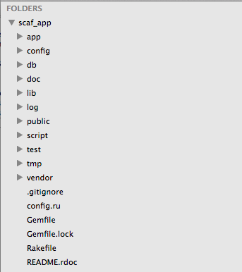

#BEWD - Rails recap

###Brooks & Brian

---


##Agenda

*	Rails review   
*	Lesson 7 Lab   
*	Lesson 8 Lab   
*	Midterm / homework questions & answers

---

##Where does Rails fit in?
### High-level: Client (Browser) <-> Server (Rails)


---

##Rails & My Browser
###The request/response cycle

*	HTTP (the protocol that drives the Web) communicates via input/output just like the terminal.

*	Browsers send input (the request) and the server returns output (the response).


---


##Get Started with Rails 4.0.0!
###Are You Ready?

	rails -v		

* If you don't see 4.0.0, raise your hand

---


##Recap 
###Make an app

	rails new brookstore
	ls 
	cd brookstore

---

##Recap 
###Scaffold

	rails generate scaffold Book title:string author:string year:integer
OR

	rails g scaffold Book title:string author:string year:integer

---


##Recap 
###Create The Table(s), apply any pending migrations

	rake db:migrate

---


##Recap 
###Start The Server

	rails server
OR

	rails s
	
* Go to localhost:3000/books in browser

---


##Scaffolding
###What scaffolding gives us

*	Scaffolds provide the bare necessities for creating, editing, deleting, and viewing a resource. Otherwise known as CRUD (Create, Read, Update, Delete).

---


##Scaffolding

Scaffolds are great when getting started with Rails or a new app, but are generally not used in production websites.

---


##Structure Of A Rails App
###brookstore




*	Most of your application logic belongs to app/ (including css and javascript files)

*	public/ contains static files that are directly available

---


##Structure Of A Rails App
### The app folder

Most of the code we write belongs somewhere in the `app` folder.

* `app/assets`: CSS, JavaScript and images used in templates.
* `app/controllers`: Classes which gather data and render responses for specific
  requests.
* `app/helpers`: Utility modules which define methods for templates to use.
* `app/mailers`: Classes that define various outbound emails in your app.
* `app/models`: Classes defining your data models (e.g.. User, Comment, Post).
* `app/views`: Templates called by your controllers to render HTML.
* `app/views/layouts`: Master templates to be used throughout your website.

 
---


##The Public Folder

Add a static file to public.

* Create the file `public/hello.txt`
* Start your server with `$ rails s`
* Visit http://localhost:3000/hello.txt

---


##Lab Time

*	Create a new application called User_Scaffold. 
*	The resource should be `User` and it should have the attributes: 
	*	First Name
	*	Last Name
	*	Age
	*	Email

__BONUS!__ Remove the ability to edit after a user has been created

_Hint:_ app/views   

---

##The Dispatcher
###routes.rb

*	Located at config/routes.rb
*	Connects URLs to code
	* Used for mapping urls to your code
*	Current Routes: `rake routes`
	*	Rails 4: Can be seen at http://localhost:3000/rails/info/routes


---

##Routes
###http verbs

GET, POST, PUT/PATCH, DELETE


---

##Http Verbs
###When GET is called.

*	Visiting a website
*	Clicking a link

---

##Model View Controller
###aka MVC


---

##MVC
###Routes to Controller

Controllers: 

*	Render a View
*	Redirect to another view


---

##Controllers
###Controllers Are Objects!


*	Responsible for parsing user request

*	It can display some text to the browser, redirect to another path or send an error message.

*	Contains actions (aka functions)

---

##Controllers
###Methods


*	Methods are called actions in Rails.

---

##Controllers
###Params


*	http://localhost:3000/games/secret_number/7

	*	7 is a param and can be taken from the params hash as so: `params[:id]` (unless configured otherwise in your config/routes.rb file)

---

##MVC
###Controller to Views

*	Views can be rendered directly by the controller
	*	Note: Not scalable when HTML file gets more complex

*	By default your controller renders the view named controller_name/action_name.html.erb


---

##Views
###html.erb

*	Can write html
*	Can write pure ruby.

		<% @games.each do |game| %>
			<%= game %>
		<% end %>
		
		<% 1 + 1 %> // won't show
		<%= 2 + 2 %> // will show!


---

##Views
###application.html.erb

*	All views are wrapped inside application.html.erb
	*	It loads the assets
	*	sets up the meta tags, titles etc...
	*	You can render no layout Or a different layout

---

##Views
###Asset Folder


---


##Rock Paper Scissors
####Task Instructions

* Add the game Rock Paper Scissors to the "Games on Rails App".

* Create a route that goes from ```/games/rock_paper_scissors/:throw``` to ```games#rock_paper_scissors_play```

* Use params[:throw] as a user's choice

* Create an array of available options for the computer to guess from (rock, paper or scissors), and then sample from that array. 

* Create a page for the rock_paper_scissors_play action and pass instance variables to the view to show the computer guess and the player guess

* The user will guess by going to: ```http://localhost:3000/games/rock_paper_scissors/rock```

* Figure out if the user has won/lost in the controller and display the result in the view

---

##Catch up

Feel free to ask questions about your midterms, homeworks, etc.

---